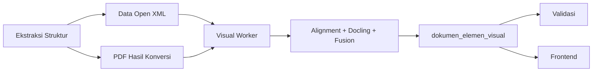

# 5.1 Layanan Analisis Visual Dokumen

Pengembangan subbab ini mengikuti struktur terdalam pada `docs/Daftar Isi.MD` dan disesuaikan dengan implementasi `src/workers/visual_worker.py`, `src/services/merging_extraction_service.py`, serta model `src/models/dokumen_elemen_visual.py`.

## 5.1.1 Peran Layanan dalam Pipeline Sistem

Subbab ini menjelaskan posisi strategis layanan analisis visual di antara ekstraksi struktur dokumen dan validasi. Fokusnya bukan hanya pada urutan proses, tetapi juga pada hubungan data yang membuat worker visual dapat mengubah struktur logis menjadi representasi visual yang siap dipakai sistem.

### 5.1.1.1 Posisi setelah ekstraksi struktur dokumen

1. Layanan analisis visual ditempatkan sesudah tahap ekstraksi struktur dokumen selesai dijalankan oleh layanan utama.
2. Pada titik ini, data Open XML sudah lebih dulu disimpan ke basis data sehingga worker visual tidak bekerja dari file DOCX mentah.
3. File PDF hasil konversi juga sudah tersedia dan menjadi representasi final yang benar-benar dilihat oleh pengguna pada antarmuka.
4. Di `visual_worker.py`, pekerjaan visual baru diproses setelah antrian labeling menemukan dokumen yang siap dianalisis.
5. Urutan ini penting karena alignment membutuhkan elemen struktur, urutan sequence, dan metadata dokumen yang sudah lengkap.
6. Jika worker visual dijalankan terlalu dini, ia hanya akan memiliki tampilan PDF tanpa identitas elemen dokumen yang benar.
7. Dengan berjalan setelah ekstraksi, layanan visual dapat langsung memetakan hasil PDF ke `dokumen_elemen` yang telah ada.
8. Tahap ini juga memastikan bahwa proses visual bekerja pada artefak yang stabil, bukan pada dokumen yang masih berubah.
9. Secara pipeline, posisi tersebut membuat analisis visual menjadi lapisan penghubung antara struktur logis dan tampilan fisik dokumen.
10. Karena itu, perannya bukan tambahan opsional, melainkan tahap lanjutan yang memang bergantung pada keberhasilan ekstraksi struktur sebelumnya.

### 5.1.1.2 Keterkaitan dengan main service dan basis data

1. Main service berperan menyiapkan data awal dokumen, termasuk menyimpan struktur hasil ekstraksi dan path file yang akan dipakai worker visual.
2. Worker visual tidak mengambil data melalui HTTP, tetapi membaca referensi dokumen langsung dari basis data yang sama.
3. Cara ini terlihat pada penggunaan `SessionLocal`, `AntrianService`, dan query model seperti `Bab` atau `Dokumen` di worker.
4. Basis data di sini menjadi medium koordinasi utama antara ekstraksi, labeling, dan validasi.
5. Melalui pendekatan tersebut, integrasi antarlayanan lebih sederhana karena tiap tahap cukup bersepakat pada skema tabel dan status pekerjaan.
6. Keluaran visual akhirnya juga dikembalikan ke basis data melalui tabel `dokumen_elemen_visual`.
7. Artinya, basis data bukan hanya tempat penyimpanan hasil akhir, tetapi juga media handoff antartahap pemrosesan.
8. Keterikatan dengan main service tampak pada fakta bahwa worker visual memakai referensi `ref_tipe`, `ref_id`, dan path yang sudah disiapkan oleh tahap sebelumnya.
9. Pola ini membuat worker visual dapat dijalankan terpisah tanpa kehilangan konteks dokumen yang sedang diproses.
10. Dengan demikian, hubungan dengan main service bersifat longgar pada level eksekusi, tetapi kuat pada level data dan kontrak status.

### 5.1.1.3 Kontribusi terhadap validasi dan frontend

1. Hasil utama layanan visual adalah elemen yang sudah memiliki label, halaman, teks ringkas, dan bounding box.
2. Informasi tersebut dipakai worker validasi untuk menunjukkan letak elemen yang melanggar aturan penulisan.
3. Tanpa data visual, validasi hanya bisa menyebut nama elemen atau sequence tanpa menunjukkan posisi nyata pada halaman.
4. Frontend juga memanfaatkan data yang sama untuk menggambar overlay atau highlight pada preview dokumen.
5. Dengan begitu, pengguna dapat memahami kesalahan secara spasial, bukan sekadar membaca pesan teks.
6. Keluaran visual juga mempermudah debugging karena service dapat menghasilkan JSON dan visualisasi halaman per page.
7. Di sisi pengembang, artefak tersebut membantu membedakan apakah masalah berasal dari ekstraksi PDF, alignment, atau fusion.
8. Di sisi pengguna, manfaat praktisnya adalah navigasi kesalahan menjadi lebih cepat dan lebih intuitif.
9. Oleh sebab itu, kontribusi layanan ini mencakup kebutuhan internal sistem dan kebutuhan presentasi hasil ke pengguna akhir.
10. Fungsi gandanya sebagai data validasi dan data visualisasi membuat layanan ini sangat sentral di keseluruhan arsitektur.

## 5.1.2 Mekanisme Pemrosesan Asinkron

Subbab ini membahas bagaimana worker visual dijalankan secara asynchronous melalui antrian dan perubahan status pekerjaan. Mekanisme tersebut penting karena layanan visual harus tetap stabil untuk dokumen panjang tanpa menghambat proses unggah di sisi pengguna.

### 5.1.2.1 Penggunaan antrian labeling

1. Worker visual berjalan dengan pola background polling yang memeriksa tabel antrian secara berkala.
2. Di implementasi saat ini, `AntrianService.get_next_labeling_task()` mencari entri yang status labeling-nya masih `in_queue`.
3. Seleksi ini penting agar hanya dokumen yang benar-benar siap yang masuk ke tahap analisis visual.
4. Dokumen yang belum selesai dikonversi ke PDF atau belum punya struktur tidak akan diambil oleh worker ini.
5. Model antrian membuat tahap visual tidak membebani request pengguna pada saat unggah dokumen.
6. Pemrosesan juga menjadi lebih tahan terhadap dokumen besar karena worker dapat berjalan terus di luar siklus request-response.
7. Selain itu, pendekatan ini memudahkan penjadwalan ulang bila sebuah dokumen perlu diproses kembali.
8. Pada level arsitektur, antrian memberi batas tegas antara tahap ekstraksi dan tahap labeling.
9. Dengan desain tersebut, layanan visual dapat diskalakan dengan menambah worker tanpa mengubah kontrak inputnya.
10. Oleh karena itu, penggunaan antrian labeling merupakan keputusan teknis yang penting untuk menjaga stabilitas pipeline.

### 5.1.2.2 Perubahan status pekerjaan

1. Begitu sebuah tugas diambil, worker segera mengubah status labeling menjadi `processing`.
2. Langkah ini mencegah dua worker memproses dokumen yang sama pada waktu bersamaan.
3. Jika seluruh proses visual selesai dengan baik, status tersebut diubah menjadi `completed`.
4. Bila terjadi exception, worker melakukan rollback dan mengubah status menjadi `failed`.
5. Pesan galat juga ikut disimpan agar operator dapat menelusuri penyebab kegagalan.
6. Mekanisme status ini membuat perjalanan satu dokumen di pipeline dapat dipantau secara eksplisit.
7. Dari sisi operasional, perubahan status juga memudahkan pembuatan dashboard monitoring pekerjaan.
8. Status yang jelas berguna saat dilakukan re-run, karena sistem dapat membedakan dokumen yang belum diproses dari dokumen yang gagal.
9. Dalam worker, transisi ini dilakukan secara terpusat melalui `AntrianService` sehingga tidak tersebar di banyak tempat.
10. Dengan demikian, perubahan status pekerjaan menjadi fondasi keterlacakan dan pencegahan proses ganda.

### 5.1.2.3 Sinkronisasi ke tahap validasi

1. Setelah labeling selesai, worker visual tidak langsung melakukan validasi pada proses yang sama.
2. Sebaliknya, ia menyerahkan dokumen ke tahap berikutnya dengan mengubah `antrian_validation_status` menjadi `in_queue`.
3. Pendekatan ini menjaga pemisahan tanggung jawab antara worker visual dan worker validasi.
4. Hasil visual sudah lebih dulu disimpan ke basis data sebelum dokumen diteruskan ke tahap validasi.
5. Karena itu, validation worker tinggal membaca hasil yang telah tersedia tanpa perlu menghitung ulang analisis visual.
6. Sinkronisasi berbasis status ini lebih sederhana dibanding pemanggilan API sinkron antarproses.
7. Pola tersebut juga memudahkan pemulihan bila salah satu worker berhenti di tengah jalan.
8. Tahap validasi hanya perlu mempercayai status bahwa labeling telah `completed` dan data visual telah persisten.
9. Dengan cara itu, handoff antarworker berlangsung eksplisit dan dapat diaudit kembali bila diperlukan.
10. Sinkronisasi melalui basis data ini menjadi salah satu alasan arsitektur pipeline tetap rapi walaupun terdiri dari beberapa tahap.

## 5.1.3 Masukan dan Keluaran Layanan

Subbab ini menjelaskan sumber data yang dipakai worker visual dan bentuk keluaran yang dihasilkan setelah fusion selesai. Penekanan utamanya adalah bagaimana PDF, struktur Open XML, dan metadata section dipadukan menjadi elemen visual final yang persisten.

### 5.1.3.1 PDF hasil konversi sebagai masukan visual

1. PDF hasil konversi adalah masukan visual utama karena ia mewakili tampilan akhir dokumen yang akan dibaca pengguna.
2. Worker mengambil path PDF dari metadata dokumen atau bab yang telah disimpan oleh tahap sebelumnya.
3. Path relatif tersebut kemudian digabungkan dengan `VOLUME_BASE_PATH` agar service memperoleh lokasi file absolut.
4. `PDFExtractor` dan `DoclingService` sama-sama memakai PDF ini sebagai sumber data visual.
5. Dengan begitu, seluruh analisis dilakukan pada representasi yang sama sehingga koordinat yang dihasilkan dapat dibandingkan langsung.
6. Penggunaan PDF penting karena struktur internal DOCX tidak selalu identik dengan tampilan final pada halaman.
7. Margin, pemenggalan baris, letak tabel, dan posisi gambar baru benar-benar dapat diamati pada hasil PDF.
8. Tahap konversi PDF juga memungkinkan worker membangkitkan citra halaman untuk kebutuhan visualisasi.
9. Oleh karena itu, PDF bukan sekadar file turunan, tetapi acuan utama untuk semua operasi spasial di tahap visual.
10. Tanpa PDF, layanan tidak akan bisa menentukan posisi elemen secara presisi pada halaman.

### 5.1.3.2 Elemen hasil ekstraksi struktur sebagai acuan

1. Selain PDF, worker visual memerlukan elemen hasil ekstraksi struktur yang berasal dari tabel `dokumen_elemen`.
2. Elemen-elemen ini dibaca ulang melalui relasi `dokumen_section` dan `dokumen_part` agar hanya bagian body yang diproses sebagai isi utama.
3. Data tersebut memuat sequence, tipe elemen, dan isi JSON tree yang menjadi identitas logis dokumen.
4. Alignment memakai informasi ini untuk menentukan elemen PDF mana yang mewakili paragraf, judul, tabel, atau elemen khusus tertentu.
5. Tanpa acuan struktur, hasil visual dari PDF hanya akan berupa blok-blok layout yang belum jelas pemiliknya.
6. Kehadiran elemen Open XML membuat worker dapat menyatukan urutan logis dokumen dengan posisi visual di halaman.
7. Atribut tambahan seperti style, font, atau placeholder visual juga dipakai untuk heuristik lanjutan.
8. Hal ini terlihat pada mixin alignment yang membangun unit Open XML dengan hint chart, visual slot, dan marker kode.
9. Dengan demikian, elemen hasil ekstraksi struktur berfungsi sebagai referensi identitas yang melengkapi bukti spasial dari PDF.
10. Kombinasi keduanya membuat sistem mampu membaca dokumen secara logis dan visual sekaligus.

### 5.1.3.3 Elemen visual final sebagai keluaran

1. Keluaran layanan ini adalah elemen visual final yang telah melewati ekstraksi, alignment, dan fusion.
2. Setiap elemen final memiliki halaman, bounding box, label visual, label struktural, dan teks yang mewakili isi elemen.
3. Jika tersedia, elemen tersebut juga menyimpan kaitan langsung ke `dokumen_elemen_id` atau `dnote_id`.
4. Di basis data, bentuk ini direpresentasikan oleh tabel `dokumen_elemen_visual`.
5. Keluaran tersebut lebih matang dibanding prediksi mentah Docling karena sudah diberi konteks struktur dan koreksi heuristik.
6. Hasil final inilah yang dibaca lagi oleh worker validasi untuk menilai aturan format atau struktur dokumen.
7. Frontend juga mengambil data yang sama untuk menggambar penanda kesalahan pada halaman tertentu.
8. Bila mode debug aktif, service menulis JSON per halaman dan gambar overlay sebagai keluaran tambahan.
9. Karena tersimpan persisten, elemen visual final dapat dipakai ulang tanpa perlu menjalankan ulang seluruh pipeline.
10. Oleh sebab itu, keluaran layanan ini dapat dianggap sebagai representasi visual operasional yang siap dikonsumsi komponen lain.

## Referensi

- Implementasi worker: `src/workers/visual_worker.py`
- Orkestrasi layanan: `src/services/merging_extraction_service.py`
- Model hasil visual: `src/models/dokumen_elemen_visual.py`
- Standar Office Open XML: https://ecma-international.org/publications-and-standards/standards/ecma-376/
